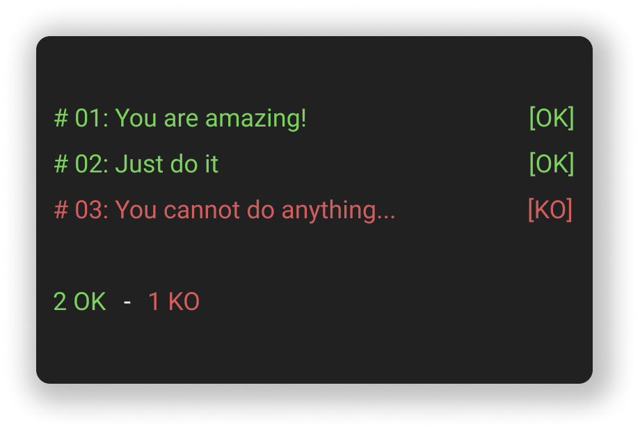

# Bash Plop

A testing framework for Bash as simple as his name is.



## Installation

The installation cannot be easier! Clone the repository in your existing project.

```shell
git clone https://github.com/vfurmane/bash-plop.git
```

And source the script file in your testing script.

```shell
#!/bin/bash

source bash-plop/bash-plop.sh

# Tests down here...
```

## Usage

Now you probably want to use the framework right? If you do, that is so simple! Again, source the script file in your testing script.

```shell
#!/bin/bash

source bash-plop/bash-plop.sh

# Tests down here...
```

Then, you will need to initialize the framework with `plop_init` function. And when you are done, call the `plop_end` function.

```shell
#!/bin/bash

source bash-plop/bash-plop.sh

plop_init

# Tests down here...

plop_end
```

Finally, just write some test.

```shell
#!/bin/bash

source bash-plop/bash-plop.sh

plop_init

plop_test_command true
plop_test_summary

plop_end
```

And voila, if you execute the script, you will see a correct test!

But it is too simple now... It is just a generic example after all... I can only suggest to you to visit the [wiki page](https://github.com/vfurmane/bash-plop/wiki) to discover all the power of this framework.
